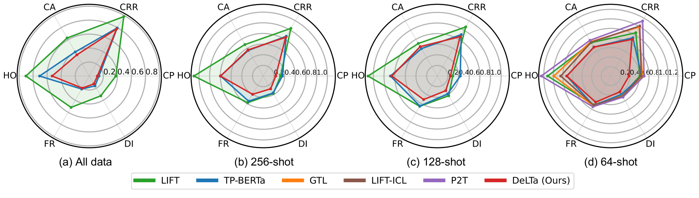
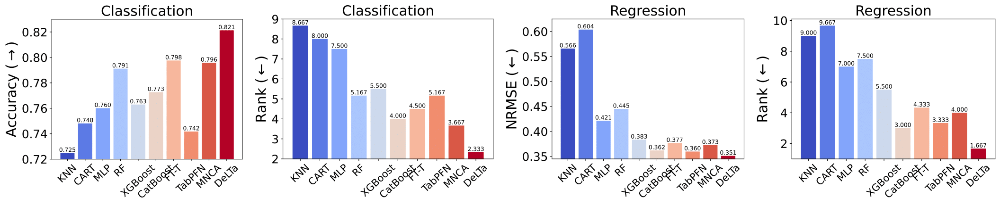

# LLM Meeting Decision Trees on Tabular Data


<div style="text-align: center; margin: 20px 0;">
  
  <p style="margin-top: 8px; font-weight: 500;">The DeLTa framework</p>
</div>

<div style="text-align: center; margin: 20px 0;">
  
  <p style="margin-top: 8px; font-weight: 500;">Test NRMSE(↓) performance of DeLTa and LLM-based baseline methods on regression tasks.</p>
</div>

<div style="text-align: center; margin: 20px 0;">
  
  <p style="margin-top: 8px; font-weight: 500;">Test performance of DeLTa and non-LLM baseline methods on classification and regression tasks.</p>
</div>

### Quick Start

```bash
export TABPFN_MODEL_CACHE_DIR="DeLTa-main/model/models/models_diff/"
```

#### 1. Obtain the rules of the random forest.
 
```bash
cd DeLTa-main
python run_randforest.py
```

#### 2. Build a prompt and place it in DeLTa/model/classical_methods/data/{dataname}/prompts.


#### 3. query the LLM and get answer
```bash
cd DeLTa-main/model/classical_methods
python run_get_answer.py
```

#### 4. Place the generated rules in a Python file within 
the directory DeLTa/model/classical_methods/llm_rule
#### 5. Fit the negative gradient.
    
```bash
cd DeLTa-main
python run.py
```
#### 6. run  error correction
    
```bash
cd DeLTa-main
python run_ensemble.py
```
Datasets are accessible via [Google Drive](https://drive.google.com/open?id=1JIsivUoM4qeM3MY9jNpXjJJH4VplndCy&usp=drive_fs).


## Citation

If you use DeLTa in your research, please cite:

```bibtex

```
