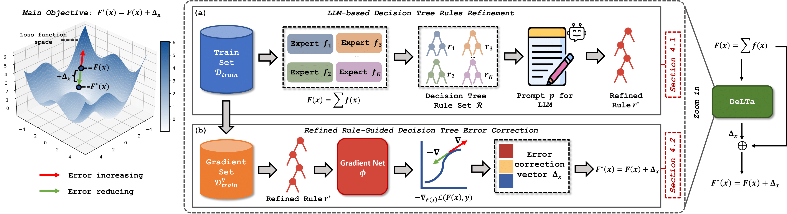

# [NeurIPS'25 Spotlight]LLM Meeting Decision Trees on Tabular Data

<div style="text-align: center; margin: 20px 0;">
  
</div>

## Official implementation of the experiments in the [DeLTa paper]().

## Usage Options

### Option 1: Quick verify the experiments reported in the paper


#### 1. Obtain the rules of the RandomForest.
 
```bash
cd DeLTa-main
python run_randforest.py
```
#### 2. Fit the negative gradient.
    
```bash
cd DeLTa-main
python run.py
```
#### 3. run  error correction
    
```bash
cd DeLTa-main
python run_ensemble.py
```

### Option 2: Including the steps to query the LLM yourself

#### 1. Obtain the rules of the RandomForest.
 
```bash
cd DeLTa-main
python run_randforest.py
```

#### 2. Build prompts

```bash
cd DeLTa-main/llm/get_prompts
python run_get_prompt.py
```


#### 3. query the LLM and get answer 
Our method has been validated with these three LLMs (GPT-4o, Qwen3-32B, and Qwen3-8B), though you are also welcome to use other models.
```bash
cd DeLTa-main/llm/query
python run_get_answer.py
```

#### 4. Place the generated rules in a Python file within the directory DeLTa-main/model/llm_rule

```bash
cd DeLTa-main/llm
python get_trees.py
```

#### 5. Fit the negative gradient.
    
```bash
cd DeLTa-main
python run.py
```
#### 6. run  error correction
    
```bash
cd DeLTa-main
python run_ensemble.py
```

### Preparing Datasets

Datasets are accessible via [Google Drive](https://drive.google.com/open?id=1JIsivUoM4qeM3MY9jNpXjJJH4VplndCy&usp=drive_fs).

If you wish to use your own dataset,please follow:
```bash
cd DeLTa-main/example_datasets
mkdir [NAME_OF_YOUR_DATASET]
```
For the specific format of the dataset, please refer to https://github.com/LAMDA-Tabular/TALENT.

Specifically,each dataset folder args.dataset consists of:

-- Numeric features: N_train/val/test.npy (can be omitted if there are no numeric features)

-- Categorical features: C_train/val/test.npy (can be omitted if there are no categorical features)

-- Labels: y_train/val/test.npy

-- info.json, which must include the following three contents (task_type can be "regression", "multiclass" or "binclass"):
```bash
{
  "task_type": "regression", 
  "n_num_features": 10,
  "n_cat_features": 10
}
```
Additionally, please add your dataset and its alternative parameters to the DeLTa-main/dataset_config.py file.

For regression tasks, we use the default values; for classification tasks, adjustments to the η parameter are required.

## Citation

If you use DeLTa in your research, please cite:

```bibtex

```
